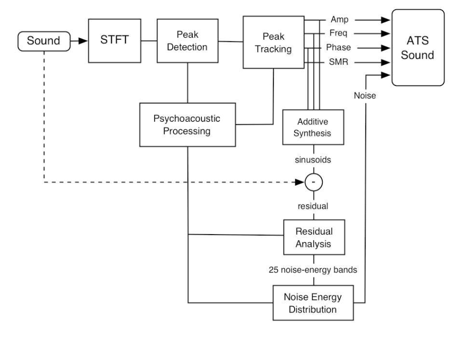

Getting Started 
===============

Installation
------------

| requires python 3.6+
| developed/tested on python 3.9.15 using M1 Mac running macOS 13.0.1
| requires LIBSNDFILE

for Mac: 

::
        
        $ brew install libsndfile

for Debian: 

::
        
        $ apt-get install libsndfile-dev

install via the PyPi repository

::
        
        $ pip install pyatsyn

# included command line utilities

::

        $ pyatsyn-atsa --help
        $ pyatsyn-info --help
        $ pyatsyn-synth --help

Example command line usage to generate an ats file with residual:

::
        
        $ pyatsyn-atsa example.wav example.ats -v -r example-residual.wav

Example to print information about a .ats file to stdout:

::

        $ pyatsyn-info example.ats
        
Example to synthesize the result using a sine-generator bank:

::
        
        $ pyatsyn-synth example.ats synthesized.wav

Example to synthesize the result a sine-generator bank and w/ band-limited noise synthesis for the residual:

::

        $ pyatsyn-synth example.ats synthesized_w_noise.wav --noise 1.0

**for Developers, if using from source**

::

        $ git clone https://github.com/boxofbox/pyatsyn

we recommend running in a virtual environment from within the project base directory

::

        $ cd pyatsyn
        $ python -m venv .venv
        $ source .venv/bin/activate

python libraries required:

::
        
        $ pip install numpy
        $ pip install soundfile

optional documentation generation requires:

::

        $ pip install sphinx

may need to be run as a package in development mode
(from within the outermost pyatsyn directory containing the pyproject.toml file)

::

        $ pip install -e .

If you are a newcomer to the ATS system we recommend you start by looking at :obj:`~pyatsyn.atsa.tracker.tracker`

ATS Overview
------------

Analysis, Transformation and Synthesis (ATS) is a spectral modeling system based on a 
sinusoidal plus critical-band noise decomposition. The system can be used to analyze 
recorded sounds, transform their spectrum using a wide variety of algorithms and 
resynthesize them both out of time and in real time.

Psychoacoustic processing informs the system's sinusoidal tracking and noise modeling 
algorithms. Perceptual Audio Coding (PAC) techniques such as Signal-to-Mask Ratio (SMR) 
evaluation are used to achieve perceptually accurate sinusoidal tracking. SMR values 
are also used as a psychoacoustic metric to determine the perceptual relevance of partials 
during analysis data postprocessing. The system's noise component is modeled using 
Bark-scale frequency warping and sub-band noise energy evaluation. Noise energy at the 
sub-bands is then distributed on a frame-by-frame basis among the partials resulting 
in a compact hybrid representation based on noise modulated sinusoidal trajectories.

Other ATS Implementations
-------------------------

Originally implemented in LISP, using the CLM sound synthesis and processing language, 
ATS has been ported to C in the form of a spectral modeling library. This library, 
called ATSA, implements the ATS system API which has served as foundation for the 
development of the ATSH graphic user interface. Written in GTK+, ATSH not only provides 
user-friendly access to the ATS analysis/synthesis core but also graphic data editing 
and transformation tools. ATS interfaces for SuperCollider, Csound and PD have also 
been developed.

C implementations of ATSA and Qatsh and Lisp archive: `DXARTS Gitlab <https://gitlab.com/dxarts/projects/ats>`_

SuperCollider Interfaces for ATS (including classes to read ATS files as well ad UGens 
to do transformation and synthesis) are included in Josh Parmenter's UGen library, JoshUGens, 
distributed in the sc3-plugins package for SuperCollider: `sc3-plugins <https://supercollider.github.io/sc3-plugins/>`_ | `docs <https://doc.sccode.org/Browse.html#UGens%3EAnalysis%3ASynthesis>`_

Csound Opcodes for ATS `Csound FLOSS manual <https://flossmanual.csound.com/sound-modification/ats-resynthesis#synthesizing-ats-analysis-files>`_

PureData binaries and toolkit `puredata ats-pd <https://puredata.info/Members/pdiliscia/ats-pd>`_

Grow your own using the ATS Binary File Format: :obj:`~pyatsyn.ats_io`

ATS Theory
----------

`(PDF) <_static/pdf/ats_theory.pdf>`_ ATS: A System for Sound Analysis Transformation and 
Synthesis Based on a Sinusoidal plus Critical-Band Noise Model and Psychoacoustics Juan Pampin 
Center for Digital Arts and Experimental Media ( `DXARTS <https://dxarts.washington.edu/>`_ ), 
University of Washington pampin@u.washington.edu
